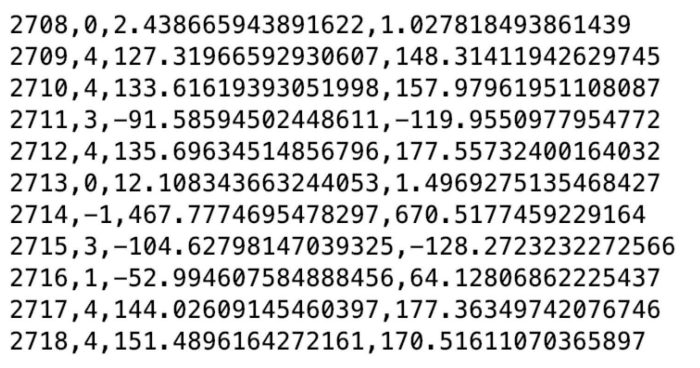

# Streaming Mining
=================================================================================

## Abstract
This project is the homework 6 for USC DSCI 553 Data Mining.
In this project, you will implement the Bradley-Fayyad-Reina (BFR) algorithm. The goal is to let you
be familiar with the process clustering in general and various distance measurements. The datasets you
are going to use is a synthetic dataset.
Please see more details in the instruction.pdf.


## Data
Download the dataset 'data.zip' file and unzip it to get and use 'hw6_clustering.txt' file as input file.
Since the BFR algorithm has a strong assumption that the clusters are normally distributed with
independent dimensions, we generated synthetic datasets by initializing some random centroids and
creating some data points with the centroids and some standard deviations to form the clusters. We also
add some other data points as the outliers in the dataset to evaluate the algorithm. Data points which
are outliers belong to clusters that is named or indexed as “-1”. Following figure shows an example of a part of
the dataset. The first column is the data point index. The second column is the name/index of the
cluster that the data point belongs to. The rest columns represent the features/dimensions of the data
point.



The 'sample_output.txt' file demonstrate a sample output.

## Environment
- Python 3.6
- JDK 1.8
- Scala 2.11
- Spark 2.4.4

## Execution
If the code is executed in local environment, simply run:

```console
python3 task.py <input_file> <n_cluster> <output_file>
```
